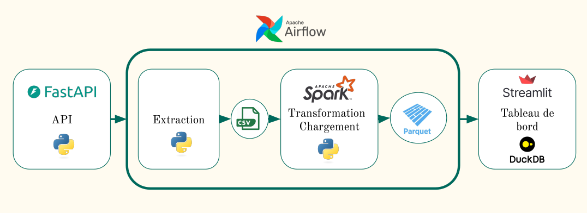

# 🏦 **Bank Branch Footfall – Data Engineering Project**

## 🚀 **Présentation du projet**  
Ce projet permet de suivre en temps réel l’affluence des visiteurs dans des agences bancaires grâce à un pipeline de données automatisé. L’objectif est d’analyser la fréquentation pour aider à l’optimisation des ressources et à la prise de décision.  

## 🔍 **Pourquoi ce projet ?**  
Dans un contexte où l’optimisation des espaces et des effectifs est clé, ce système permet de :  
✅ **Anticiper les pics d’affluence** pour ajuster le personnel.  
✅ **Optimiser les horaires d’ouverture** en fonction des flux réels.  
✅ **Améliorer l’expérience client** en réduisant les temps d’attente.  
✅ **Exploiter ces analyses dans d’autres secteurs** comme les commerces, musées ou transports.  

## 🏗️ **Architecture du projet**  


### 1️⃣ **API FastAPI** 🌐  
[API live](https://bank-branch-footfall.onrender.com/get_visitor_count?date_time=2025-05-29%2009:05&agency_name=Aix_les_bains_1)

Une API REST générant des données sur le nombre de visiteurs entrant dans une agence bancaire par heure.  

### 2️⃣ **Pipeline ETL** 🔄  
- **📥 Extraction** : Un script Python récupère les données via API et les stocke en CSV.  
- **🛠️ Transformation avec Spark** : Nettoyage des données, agrégation et calcul de moyennes sur les jours précédents.  
- **💾 Chargement** : Stockage des données transformées au format **Parquet** pour une exploitation rapide et optimisée.  

### 3️⃣ **Orchestration avec Airflow** ⏳  
- **📌 DAG principal** : Extraction et transformation toutes les heures.  
- **🔄 DAG de backfill** : Recharge des données après une panne pour éviter toute perte.  

### 4️⃣ **Visualisation avec Streamlit** 📊  
[Application live](https://bank-branch-footfall.streamlit.app/)

Une interface interactive où l’utilisateur peut sélectionner :  
✔️ Une agence bancaire  
✔️ Un détecteur spécifique  
✔️ Une période pour visualiser les flux de visiteurs  

## 🛠 **Technologies utilisées**  
🚀 **FastAPI** – API REST  
🐍 **Python** – Extraction des données  
⚡ **Apache Spark** – Traitement et transformation  
📦 **Parquet** – Stockage optimisé
🦆 **DuckDB** – Chargement de Parquet vers DB   
🛩 **Apache Airflow** – Orchestration du pipeline  
📊 **Streamlit** – Visualisation interactive  

## 📌 **Installation et utilisation**  

### 🚀 **1. Cloner le dépôt**  
```bash
git clone https://github.com/MichaelG-create/bank-branch-footfall.git
cd bank-branch-footfall
```

### 🚀 **1. Créer un venv et installer le requirements.txt **  
```bash
python3 -m venv .venv
source .venv/bin/activate
pip install -r requirements.txt
```

### 🌐 **2. Lancer l’API**  
```bash
uvicorn api.app:app --reload
```
📍 Accès à la documentation interactive : [http://127.0.0.1:8000/docs](http://127.0.0.1:8000/docs)  

### 🔄 **3. Exécuter le pipeline ETL**  
```bash
python3 extract/extract.py  # Extraction des données API
python3 transfrom_load/transfrom_load.py  # Transformation et chargement
```

### ⏳ **4. Lancer Airflow**  
Démarrer Airflow et activer les DAGs pour l’orchestration.  
```bash
airflow standalone
```
Les DAGS : 
- banking_pipeline.py : DAG de fonctionnement en temps réel
- banking_pipeline_back.py : DAG de backfill

### 📊 **5. Lancer Streamlit**  
```bash
streamlit run webapp/app.py
```
📍 Interface de visualisation des données en temps réel.  

## 🔮 **Perspectives et améliorations futures**  
🔹 **Prise en compte des événements exceptionnels** (jours fériés, promotions, météo).  
🔹 **Ajout d’un modèle de prédiction** pour anticiper les flux.  
🔹 **Intégration d’une base distribuée** (Delta Lake, BigQuery) pour une scalabilité accrue.  
🔹 **Mise en place d’alertes et notifications** en cas d’affluence anormale.  

## 👤 **Auteur**  
Développé par Michael Garcia, passionné par la data engineering et l’automatisation des pipelines de données.
